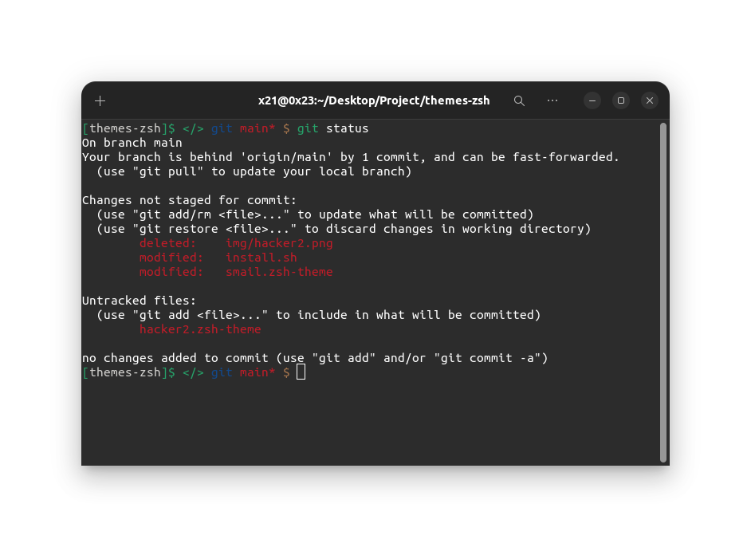

# themes-zsh
zsh Themes for hackers
# image of hacker zsh


# image of smail zsh

## install 

```bash
git clone https://github.com/nimacpp/hacker-zsh.git 
cd hacker-zsh
chmod +x install.sh
./install.sh 
```

 and than 
 ``` nano ~/.zshrc ```
 and change to
 ZSH_THEME="hacker"
 and in the end 
 ``` source ~/.zshrc ```

